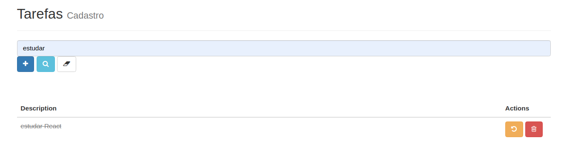
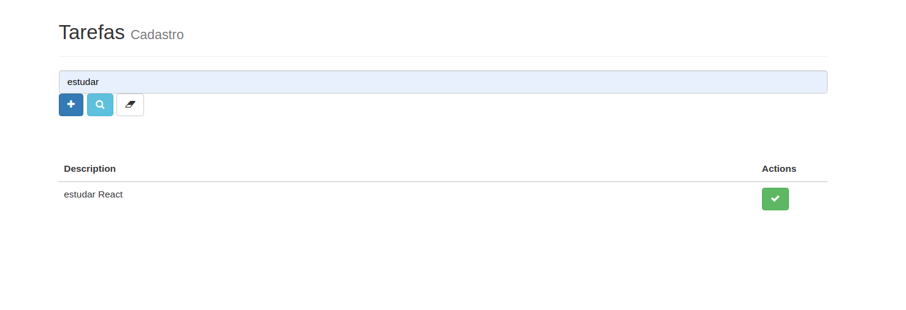

# todo-app

This code implements a Task List with React, using a NodeJs + MoogoDB backend.

Our list allows you to add task, mark as completed, mark as pending, and delete a task. A search of task was also developed, which uses charset to find a similar tash.
A task composed of: description, status and a created at; and is export by restfull by node-restful: https://www.npmjs.com/package/node-restful.

The database is in MongoDB, and uses using the mongoose as asynchronous ORM to manipulated the schems: https://www.npmjs.com/package/mongoose

Our backend API allows the use of all the main RestAPI methods (GET, POST, PUT and DELETE). Managed by the Express: https://www.npmjs.com/package/express

The frontend is using React in a single page application. It has a simple menu and main screen has a task list, and funtions to find a task, add a new task, change task status and remove a task.
https://pt-br.reactjs.org/

